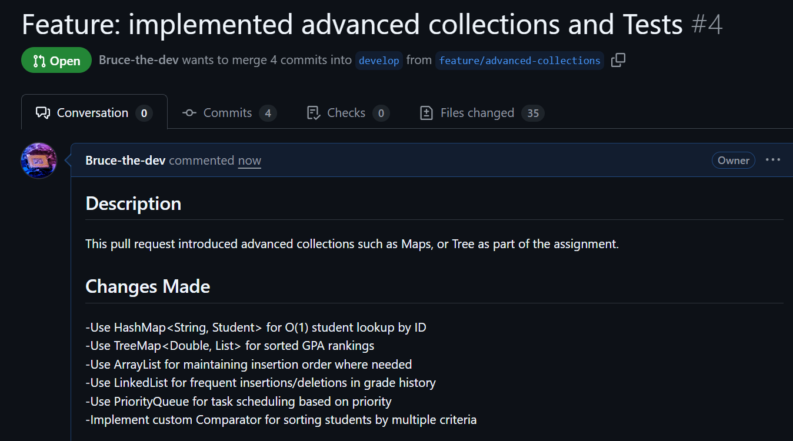
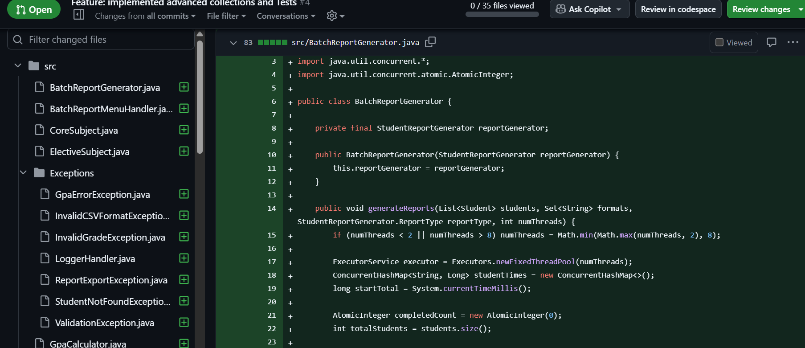

# Student Grade Management System – Lab 3

This project implements a concurrent, thread-safe student grade management system.
It focuses on performance, scalability, and reliability using advanced Java features
including concurrent collections, thread pools, background tasks, and asynchronous I/O.

---

## Collections Design Decisions

| Collection | Used In | Reason |
|-----------|--------|--------|
| `ConcurrentHashMap` | CacheManager | Thread-safe access with high performance |
| `LinkedHashMap` | Statistics distribution | Maintains insertion order for display |
| `HashMap` | Aggregations | Fast lookups when thread safety not required |
| `ConcurrentLinkedQueue` | AuditLogger | Lock-free, non-blocking logging |
| `BlockingQueue` | AuditLogger | Guarantees no log loss under concurrency |
| `ArrayList` | Computations | Fast iteration during calculations |

Design decisions prioritize:
- Thread safety
- Performance under concurrent access
- Clear separation of responsibilities

---

## Thread Pool Configuration

### Cache Auto-Refresh
- Uses `ScheduledExecutorService`
- Single-threaded scheduler to avoid race conditions
- Refresh interval configurable (60 seconds)

### Audit Logging
- Uses `ExecutorService` with a single background writer thread
- Ensures asynchronous file writes
- Prevents blocking main application flow

### Why Single-Thread Executors Were Chosen
- Guarantees log order
- Prevents file corruption
- Simplifies synchronization

---

## Regex Patterns Used

| Field | Regex Pattern | Purpose |
|-----|--------------|--------|
| Student ID | `^STU\\d{4}$` | Enforces standardized student IDs |
| Email | `^[\\w.-]+@[\\w.-]+\\.[A-Za-z]{2,}$` | Email validation |
| Phone | `^\\+?\\d{10,15}$` | International phone format |

All regex validations are unit-tested.

---

## Testing Instructions
Run tests with JUnit 5.

## Setup Instructions

1. Clone the repository
2. Ensure Java JDK 21+ is installed

```md
javac -d out src/**/*.java
java -cp out Main
```

HashMap lookup remained constant regardless of dataset size, while ArrayList search time increased linearly. This empirically validates O(1) vs O(n) complexity and justifies the use of HashMap for student and grade lookup.

## 📝 Screenshots of Pull Requests
### PR Overview


### Files Changed

---

## 🙋‍♂️ Author
**Bruce Mutsinzi** 
---
